## 📬 Connect with me

## 💻 Tech Stack:

	<code></code>
	<code></code>
	<code></code>
	<code></code>
	<code></code>
	<code></code>
	<code></code>
	<code></code>
	<code></code>
	<code></code>
	<code></code>
	<code></code>
	<code></code>
	<code></code>
	<code></code>
	<code></code>
	<code></code>
	<code></code>
	<code></code>
	<code></code>
	<code></code>
	<code></code>

## 📊 GitHub Stats:
<table>
  <tr>
    <td rowspan="2" width="50%">
       
    </td>
    <td>
      
    </td>
  </tr>
  <tr>
    <td align="center">
      
    </td>
  </tr>
</table>

<!-- Proudly created with GPRM ( https://gprm.itsvg.in ) -->

